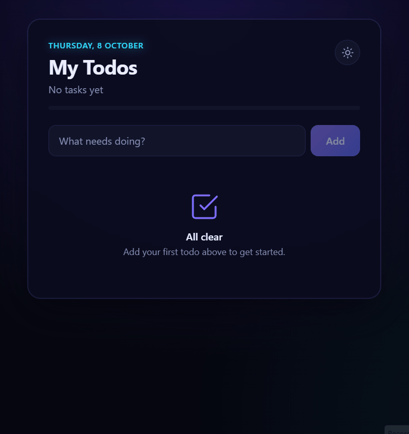

# My Todos


A todo list app built with Angular 22 and a .NET 10 Web API.



## Features

- View, add and delete todos
- Mark todos as complete
- Progress bar showing how many are done
- Filter by All, Active or Done, with counts
- Title validation in both the app and the API (required, up to 200 characters)
- Instant updates that roll back with a message if the server can't be reached
- Loading, empty and error states
- Light and dark themes, remembered between visits
- Keyboard and screen-reader friendly
- Works on mobile

## Running locally

Requirements: .NET 10 SDK and Node.js 22 or later.

```bash
npm start
```

Then open http://localhost:4200.

On the first run this installs the frontend packages. It then starts the API on http://localhost:5225 (API docs at http://localhost:5225/swagger), waits for it to be ready, and starts the Angular app on port 4200. Requests to `/api` are proxied from Angular to the API. Data is held in memory and resets when the API restarts.

## Tests

```bash
npm test
```

Runs the backend tests (xUnit, unit and integration) and the frontend tests (Vitest).

## Project structure

- `backend/` – .NET 10 Minimal API, organised by feature: endpoints, a service and an in-memory repository
- `frontend/` – Angular 22 app using standalone components and signals

## Technical notes

- The in-memory repository sits behind an interface and is registered as a singleton.
- Todos are immutable records updated with compare-and-swap, so concurrent requests are safe without locks.
- Errors follow the ProblemDetails standard, and completing a todo uses `PATCH`.
- The frontend keeps state in a signal-based store; the filters and counts are derived from it.
- Both themes use the same components and switch via CSS variables.